<div align="center">
  
</div>

<br/>

<div align="center">
  <a href="https://linkedin.com/in/faizan-khan-57092832a"></a>
  <a href="mailto:fk6307672466@email.com"></a>
  <a href="https://github.com/FaizanKhan2910"></a>
  
</div>

<br/>

<div align="center">
  
</div>

<br/>

> 🛰️ **transmission //** deep space is dark on purpose here — every panel below reports live from GitHub's own satellites (stats, streak, trophies, contribution feed).

<br/>

## 🌌 Mission Log — About

<div align="center">
  
</div>

<br/>

## 📡 Live Feed — Contribution Chart

<div align="center">
  
</div>
<p align="center"><sub>a snake eats through my real commit graph, refreshed every 12h by a GitHub Action</sub></p>

<div align="center">
  
</div>
<p align="center"><sub>this second chart is the actual day-by-day contribution/activity graph — GitHub's own widget, just restyled</sub></p>

<br/>

## 🛰️ Payload — Experience

> **drwxr-xr-x**  `Software Developer Intern — Full-Stack & AI`
> `Healthrytrix Healthtech Solutions` · Bengaluru · 2026
>
> Built voice-assessment workflows end-to-end — **React/Next.js** frontend, **FastAPI** backend, **PostgreSQL** for assessment metadata.

<br/>

## 🪐 Orbit Map — Projects

```
projects
├── 🪐 DENTRA/                → AI dental diagnostics · YOLOv8 + Llama-3       [🥇 1st · National · 70+ teams]
├── 🪐 SigmaGPT/              → AI image-gen SaaS · live Stripe billing        [100+ txns/mo · 50+ concurrent users]
├── 🪐 CodeForge-AI/          → LLM code reviewer · AST + vuln scanning        [🥇 1st · CODEFORGE 2K25 · 53+ teams]
├── 🪐 IP-SAKTI-Sahayak/      → Voice-guided Ayurvedic IP/legal RAG assistant  [Hindi + English, cited answers]
├── 🪐 PRISMA/                → Privacy-first mental wellness app             [voice stress/emotion detection]
├── 🪐 Stock-Trading-Platform/ → Real-time fintech dashboard                  [sub-100ms · P&L analytics]
├── 🪐 Wanderlust/            → Airbnb-style travel booking platform
├── 🪐 RIPPPLER/              → Predictive causal-graph DBMS                  [Neo4j + Groq/Llama-4]
└── 🪐 Portfolio/             → 3D interactive site · Next.js 14 + Three.js   [scroll-reactive robot hero]
```

<br/>

## 🌠 Trajectory — Hackathon Wins

<div align="center">
  
  
</div>
<div align="center">
  
  
</div>
<div align="center">
  
  
</div>

<div align="center">
  
</div>

<br/>

## ⚙️ Systems — Tech Stack

<div align="center">


</div>

<br/>

## 🏆 Trophy Bay

<div align="center">
  
</div>

<br/>

## 📊 Telemetry — Stats

<div align="center">
  
  &nbsp;
  
</div>
<div align="center">
  
</div>

<br/>

<div align="center">
  
</div>

<div align="center">
  <a href="https://linkedin.com/in/faizan-khan-57092832a">
    
  </a>
</div>

<div align="center">
  
</div>
